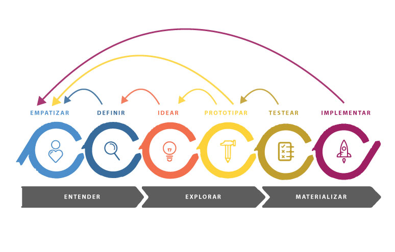
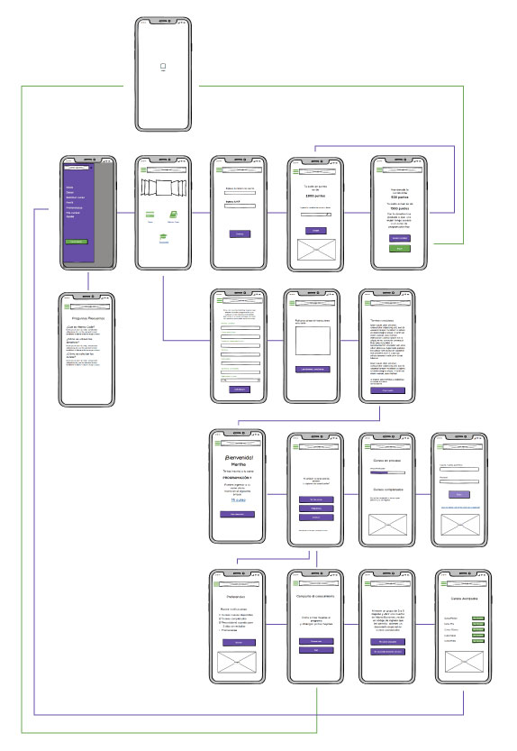
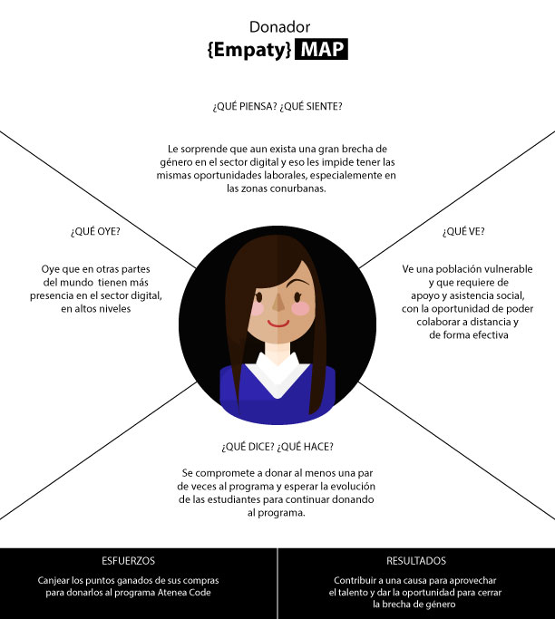
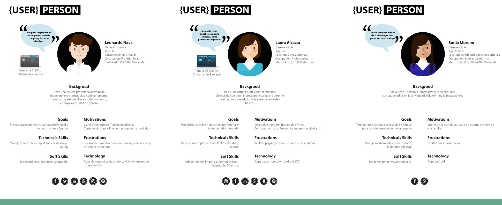
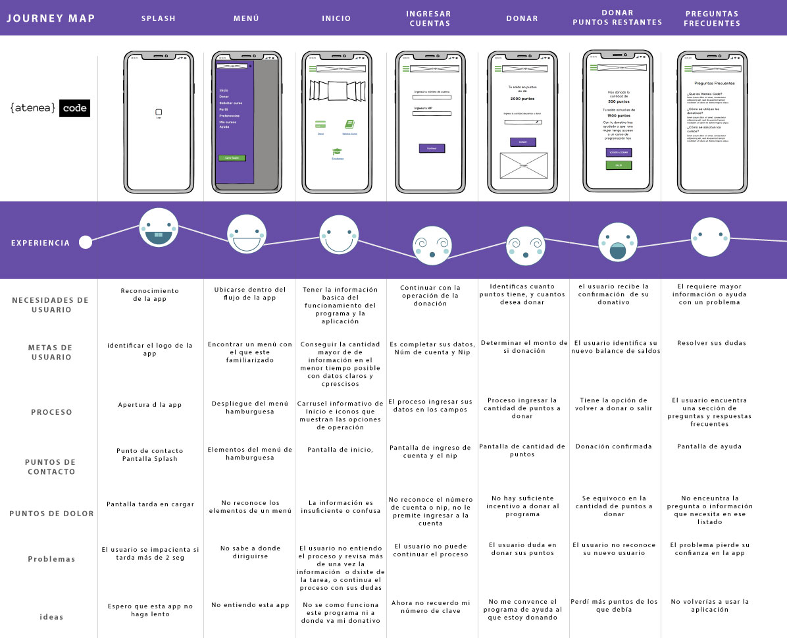
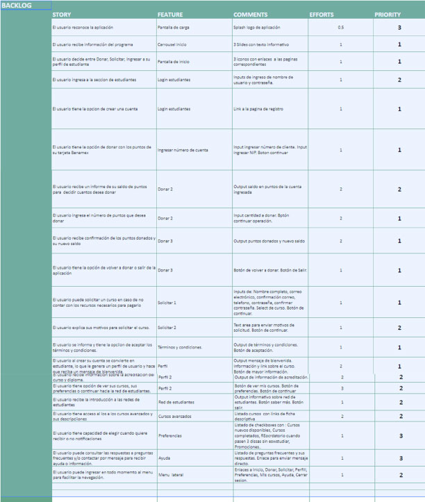

## El Reto
Somos una startup en busca de la siguiente gran aplicación móvil. En el cual se utilizarán las APIs públicas de Citibanamex.

¿Qué se espera?
Utilizar marcos o metodologías como Design thinking decidan el propósito de su nueva app.
Generar personas para los usuarios de la app.
Generar los customer journeys , flows y prototipos necesarios para llevar a cabo user testing
Generar una front end app en dispositivo móvil que utilice por lo menos dos de las APIs de Citibanamex (autorización y otra)
El código deberá de ser depositado en un repo público como Github

## Objetivo

Somos una Startup con pasión por la actividad social, tratando de amenizar el avance tecnológico a los diferentes sectores del país. 
Proponiendo la democratización del conocimiento y principalmente con el objetivo de eliminar la barrera de género que existe hoy en las mujeres respecto a su participación y oportunidades en el ambiente tecnológico. 

Crear una aplicación para acercar a las mujeres de bajos recursos a cursos tecnológicos, para  mejores oportunidades en su vida.

#### FLUJO DE TRABAJO

Se utilizo la metodologìa: Desing Thinking,

* Empatizar con las jóvenes que no tienen acceso a la tecnología.

* Definir las necesidades de los usuarios en base al Research en brecha de género.

* Idear características de la aplicación que puedan satisfacer la necesidades mencionadas.

* Prototipar a partir de wireframes realizados en Balsamiq.

* Desarrollar el código y maquetado de una Simple Page Application en React utilizando frameworks Bootstrap 4.0 entre otras herramientas, incluyendo el desarrollo de una base de datos de usuarios en Firebase y utilizando routing para el cambio de vistas

#### WIREFRAME

#### MAPA DE EMPATíA

Utilizado para conocer las tareas, necesidades, motivaciones, emociones, influencias y painpoints de los usuarios.

#### USER PERSONA

Se tomo como usuario donante a una mujer de 27 años que tiene una carrera profesional terminada,Licenciada con buen ingreso mensual que le permite realizar compras adicionales a sus necesidades básicas

Se tomo como usuario estudiante a una mujer de 25 años que tiene un trabajo informal ya que no continuo con sus estudios en la univeridad, sólo término la prepa abierta

#### CUSTOMER JOURNEY MAP

Elaborado para conocer los puntos donde nuestros usuarios podrìan encontrar dificultades para completar la tarea de ahorrar acción de ahorrar.

Al no haber una aplicación previa se tomaron en consideración los puntos que en nuestra hipotesís plantearon mayor desafìo en el comportamiento de los donantes

#### FUNNEL DE CONVERSIÓN
    DONANTES
    * Atraer al user person a la donaciónación a través de sus contribuciones remuneradas con más puntos
    * Brindarles informaci{on sobre el proceso de donación de sus puntos con Citibanamex
    
    CITIBANAMEX
    *Fidelización de nuevos clientes jóvenes como clientes Citibanamex orientandolos a a ahorrar en una cuenta y poder adquirir una TDc con el banco

### INSIGHTS

- El 35% de las muejeres podrían usar la aplicación hasta terminar los cursos
- No podrían adquirir en seguida los siguientes hasta poder pagarlos
- Las estudiantes estarían interesadas en adquirir su siguiente curso con un nuevo empleo

### BACKLOG

## CONCLUSIONES

Atenea Code viene a cubrir las necesidades de un grupo que presenta una vulnerabilidad al ser un sector discriminizado por falta de recursos necesarios para solventar sus estudios

Atenea Code presenta una navegaciòn amigable e intuitiva que facilita la itneracciòn del usuario y promueve el ahorro programado para el retiro en un dispositivo de fàcil acceso para esta generaciòn.

Estamos convencidas que Atenea Code es un producto escalable, redituable y que mejora la experiencia de usuario de los clientes con el banco.

## Colaboradores:

* Angelica Fuentes
* Diana Golmenero
* Elzbeth Blanco
* Jessy Cuevas

